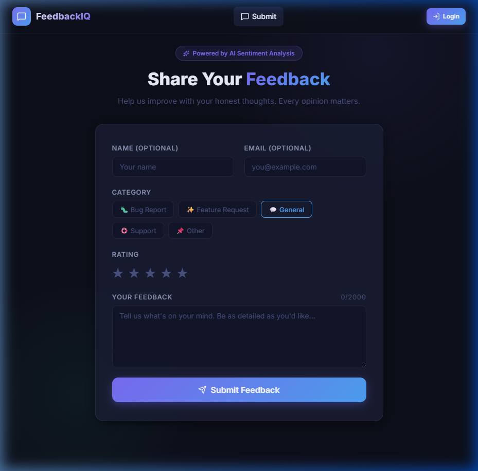
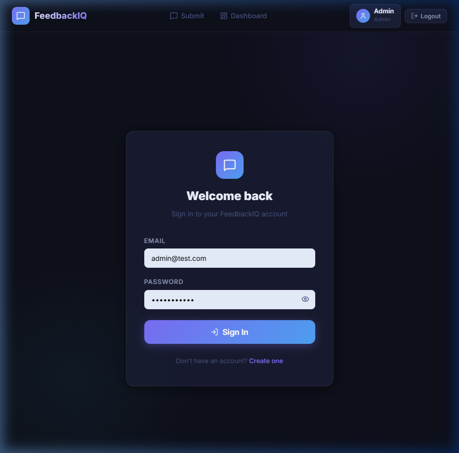
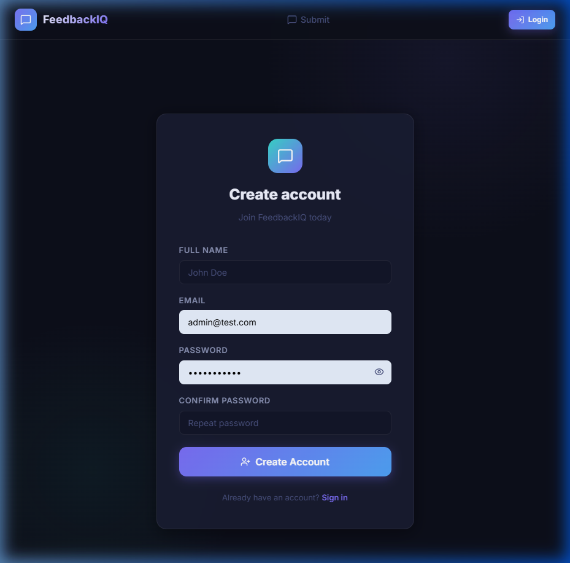
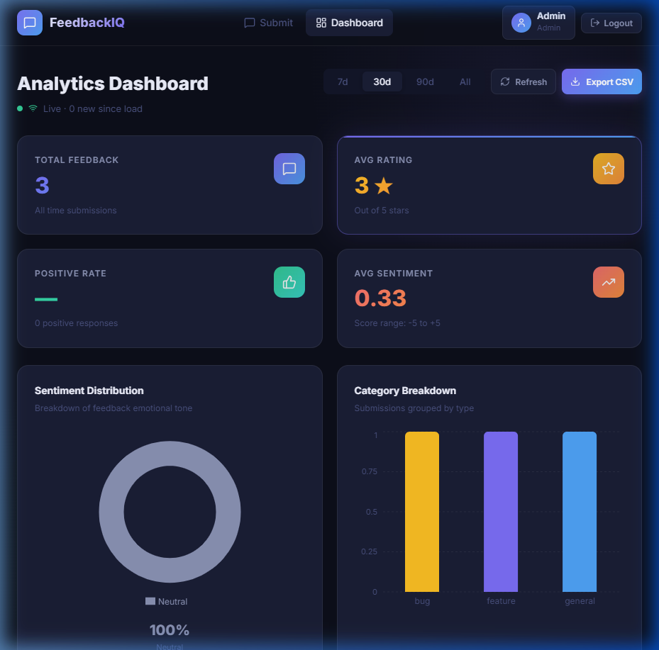
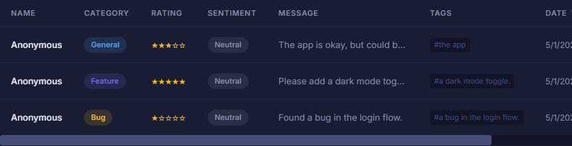

# FeedbackIQ - Smart Feedback Collection & Analysis System


FeedbackIQ is a modern, full-stack feedback management platform designed to turn user comments into actionable insights. It features real-time sentiment analysis, categorical breakdown, and a high-performance analytics dashboard for administrators.

---

## 🚀 Key Features

- **Public Feedback Interface**: Beautiful, responsive form with star ratings, categorical tags, and character limits.
- **AI Sentiment Analysis**: Every piece of feedback is instantly analyzed for emotional tone (Positive, Neutral, Negative) and assigned a sentiment score.
- **Real-Time Admin Dashboard**: Live updates via Socket.IO. See new feedback and updated charts the moment they are submitted.
- **NLP Tag Extraction**: Automatically extracts key themes and tags from user comments.
- **Rich Data Visualizations**: Interactive charts for sentiment distribution, category breakdowns, and rating histograms.
- **Role-Based Security**: Secure JWT authentication with distinct User and Admin roles.
- **Data Portability**: Export your filtered feedback data to CSV for external reporting.

---

## 📸 Screenshots

### 1. Public Feedback Form
*Capture user sentiment with an intuitive, glassmorphic interface.*


### 2. User Authentication
*Secure Login and Registration with JWT protection.*



### 3. Analytics Dashboard
*Monitor KPIs and trends with real-time, interactive data visualizations.*


### 4. Feedback Management
*Administrators can review, filter, and manage all submissions in a detailed data table.*


---

## 🛠️ Technical Stack

**Frontend:**
- React 18 + Vite
- Zustand (State Management)
- Recharts (Data Visualization)
- Lucide React (Icons)
- Framer Motion (Animations)
- Custom Vanilla CSS (Design System)

**Backend:**
- Node.js & Express
- MongoDB + Mongoose
- Socket.IO (Real-time events)
- Sentiment & Compromise (NLP & Analysis)
- JWT (Authentication)

---

## ⚙️ Installation & Setup

### 1. Clone the Repository
```bash
git clone https://github.com/yourusername/feedback-iq.git
cd feedback-iq
```

### 2. Backend Configuration
```bash
cd server
npm install
# Create a .env file and add your MONGO_URI and JWT Secrets
npm run dev
```

### 3. Frontend Configuration
```bash
cd client
npm install
npm run dev
```

---

## 📝 License

Distributed under the MIT License. See `LICENSE` for more information.

---

*Built with ❤️ by josephvincenp2804*
